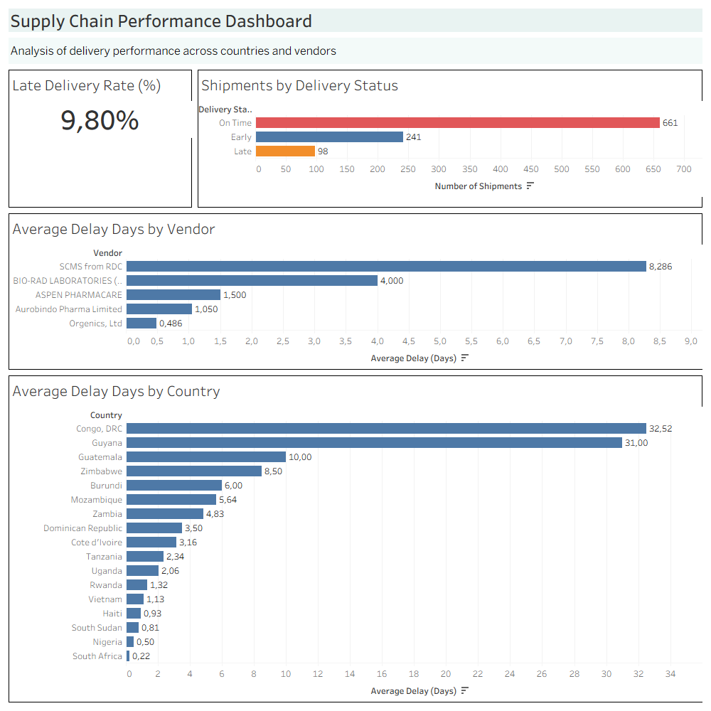
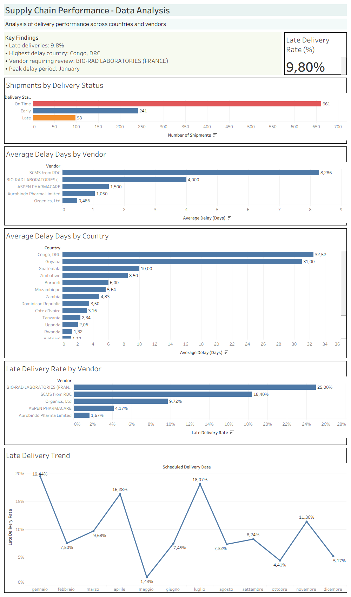

# Supply Chain Performance Analysis

**Data Analyst / Business Analyst Portfolio Project**

Analysis of shipment data to identify delivery performance issues, vendor performance patterns and operational bottlenecks using SQL and Tableau.

---

# Project Overview

This project analyzes pharmaceutical supply chain shipment data to evaluate delivery performance, identify delay patterns and understand potential operational issues.

The analysis was developed from both a **Business Analyst** and **Data Analyst** perspective:

- Business Analyst perspective: providing high-level insights to support operational decisions.
- Data Analyst perspective: exploring data patterns, calculating KPIs and identifying performance drivers.

---

# Business Questions

The analysis aims to answer the following questions:

- What percentage of shipments are delivered late?
- How is delivery performance distributed across shipment statuses?
- Which countries show the highest delivery delays?
- Which vendors have the highest late delivery rate?
- Are delivery delays changing over time?
- Which areas require further investigation?

---

# Dataset

The dataset used for this project was sourced from Kaggle:

**Supply Chain Shipment Pricing Data**  
Kaggle dataset by Sawandi Kirby

Source:

https://www.kaggle.com/datasets/sawandikirby/supply-chain-shipment-pricing-data

The original dataset is not redistributed in this repository.

A cleaned version of the dataset used for analysis is included in the `data` folder.

---

# Tools Used

## Excel

Used for:
- data preparation
- initial cleaning
- validation of dataset structure

## SQL (BigQuery)

Used for:
- data exploration
- KPI calculation
- delivery performance analysis
- vendor and country analysis

SQL scripts are available in:
sql/supply_chain_analysis.sql

## Tableau

Used for:
- interactive dashboards
- data visualization
- business reporting

---

# Data Preparation

Before analysis, the dataset was prepared and validated.

Main preparation steps included:

- correcting column formatting issues
- validating data structure
- preparing date fields
- checking data consistency
- creating a clean dataset for analysis

Clean dataset:
data/tableau_dataset_clean.xlsx

---

# SQL Analysis

SQL analysis was performed to investigate:

- dataset overview
- delivery performance
- vendor performance
- shipment mode performance
- country performance
- product group performance
- delivery trends over time

The analysis includes calculations for:

- total shipments
- late shipments
- late delivery percentage
- performance comparisons

---

# Key Performance Indicators (KPIs)

## Late Delivery Rate

Percentage of shipments delivered after the scheduled delivery date.

## Shipment Volume

Total number of shipments analyzed.

## Average Delay Days

Average number of days between scheduled delivery and actual delivery.

## Vendor Performance

Evaluation of vendors based on shipment volume and late delivery rate.

---

# Dashboards

The Tableau workbook containing both dashboards is available in the `dashboards` folder.

The workbook includes:

- Executive Dashboard
- Data Analysis Dashboard

---

## Executive Dashboard

**Business Analyst View**

Designed for decision makers and operational stakeholders.

Focus areas:

- overall delivery performance
- shipment status distribution
- country performance
- vendor delay analysis

Purpose:

Provide a concise overview of supply chain performance and highlight areas requiring attention.

---

## Data Analysis Dashboard

**Data Analyst View**

Designed for deeper analytical exploration.

Additional analysis includes:

- late delivery rate by vendor
- delay trends over time
- operational patterns

Purpose:

Identify potential causes of delivery issues and support data-driven investigation.

---

# Key Findings

The analysis identified several operational insights:

- Late deliveries represent approximately **9.8%** of total shipments.
- **Congo, DRC** shows one of the highest average delay values.
- **BIO-RAD LABORATORIES (FRANCE)** shows the highest late delivery rate among analyzed vendors.
- Delivery delays show specific peaks during the analyzed period, requiring further investigation.

These findings highlight potential areas for supply chain performance improvement.

---

# Repository Structure
Supply-Chain-Performance-Analysis

├── data
│ └── tableau_dataset_clean.xlsx
│
├── sql
│ └── supply_chain_analysis.sql
│
├── dashboards
│ └── Supply_Chain_Performance_Dashboard.twbx
│
├── images
│ ├── Supply_Chain_Executive_Dashboard.png
│ └── Supply_Chain_Data_Analysis_Dashboard.png
│
├── reports
│ ├── Supply_Chain_Executive_Dashboard.pdf
│ └── Supply_Chain_Data_Analysis_Dashboard.pdf
│
└── README.md

---

# Skills Demonstrated

- Data Cleaning
- SQL Analysis
- KPI Development
- Tableau Dashboard Development
- Business Analysis
- Data Visualization
- Supply Chain Analytics

---

# Author

Stefano La Rosa

Portfolio project developed to demonstrate Data Analyst and Business Analyst skills through SQL analysis and Tableau reporting.